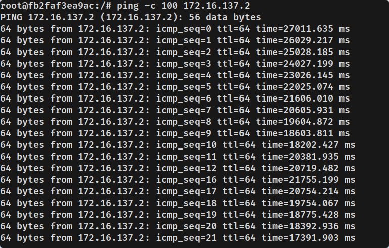
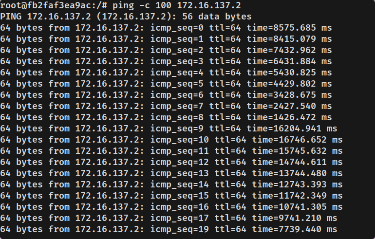
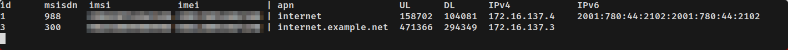

# osmocom network in docker container

Test branch for antsdr e200 device. Sinse author haven't got antsdr device, there may be incapabilities. Feel free to open issues and try fix it together.

In this branch UHD driver compiled from source https://github.com/MicroPhase/antsdr_uhd, as well as osmo-trx to support custom driver.

Also, instead of bridge network, `network_mode=host` is used to get rid of network-related issues with antsdr e200 connectivity.

## gprs

DNS confirugration for default apn is in `./configs/dnsmasq/apn0.conf`

You can check who is currently using gprs with `./helpers/show-pdp.sh` or `./helpers/mon.sh`

You can also check the traffic on the apn0 interface with `./helpers/wireshark.sh`. This script will forward tcpdump output from container to wireshark.

### gprs network slow/not work

By default android/ios devices send large amount of traffic, which results in network degradation. You can work around this behavior by responding to any dns request with localhost. Just uncomment rules in `./configs/dnsmasq/apn0.conf`:
```
address=/#/127.0.0.1
address=/#/::1
```

Below are examples of ping timings with default DNS settings and DNS that responds with localhost to everything.

Default dns configuration, all mobile traffic goes through egprs:


Dns config resolves everything to localhost:


You can also enable/disable routing mobile traffic to the internet with `routing-enabled: true/false` in `./configs/config.yml` file:
```yaml
...
egprs:
  routing-enabled: true
  ...
```
This option will or will not setup iptables routing inside docker container.

## helpers

Here is bunch of scripts to analyze UE's behaviour or to interact with the network.

wireshark.sh - sniff on apn0 interface and show it in wireshark

send-*.sh - do manual interaction

show-pdp.sh - show current egprs usage

show-subscribers-msc.sh - show subscribers on msc

show-subscribers-hlr.sh - show subscribers on hlr

mon.sh - show currently online subscribers in table



## problems

- if MS leaves the network without detaching IMSI, it will be "active" for up to 8 minutes. This is because the minimum value for T3212 timer (location update) is 6 minutes, and MSC requires some time gap between T3212 value in BSC and MSC. Without gap, MSC may expire active subscribers.
- IPv6 routing not configured
- sometimes devices may be not properly "passed" to container. Stop container, reconnect device and start container again may help

## todo
- silent call/paging interaction
- setup default values if some fields in `./configs/config.yml` does not exists (for now deleting field from config.yml would cause crash)
- test/fix egprs with network_mode=host on antsdr_e200 branch
