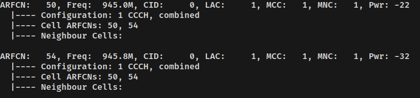

# osmocom network in docker container

This branch utilizes multi trx feature for osmo-trx-uhd, see 13.2 Multi-ARFCN mode: https://downloads.osmocom.org/docs/osmo-trx/master/osmotrx-usermanual.pdf

This should work on usrp b210. Tested only with LibreSDR B220 mini (XC7A100T+AD9361)

Be noticed that osmo-bsc automatically sets second arfcn as `arfcn trx0 + 4`

As described in the documentation, using usrp b210 you can setup two base stations.

Base stations found by grgsm_scanner:

